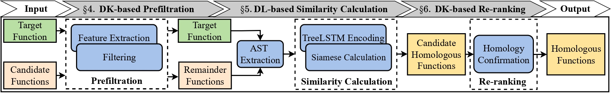
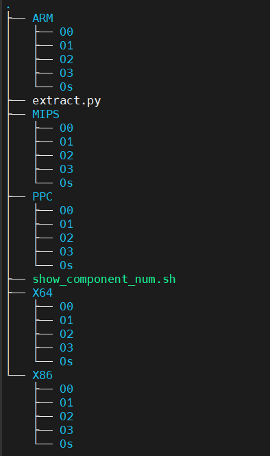

# Asteria-Pro
This is the official implementation of Asteria-Pro, a binary code similarity detection tool, as an enhancement version of [Asteria](https://github.com/Asteria-BCSD/Asteria), which has been accepted by ACM Transactions on Software Engineering and Methodology ([ToSEM](https://dl.acm.org/doi/10.1145/3604611)). 

```
@article{Yang2023AsteriaProED,
  title={Asteria-Pro: Enhancing Deep-Learning Based Binary Code Similarity Detection by Incorporating Domain Knowledge},
  author={Shouguo Yang and Chaopeng Dong and Yang Xiao and Yiran Cheng and Zhiqiang Shi and Zhi Li and Limin Sun},
  journal={ACM Transactions on Software Engineering and Methodology},
  year={2023}
}
```

It is designed and optimized for **efficient and accurate vulnerability detection** (a.k.a bug search) task.

The workflow of Asteria-Pro is depicted as follows:


It mainly consists of three parts: DK-based prefiltration, DL-based similairty calculation, and DK-based re-ranking, where DK stands for Domain Knowledge, and DL stands short for Deep Learning.
It utilizes DK-based prefiltration to eliminate a siginificant portion of *dissimilar* functions.
DL-based similarity calculation module encodes ASTs into representation vectors using the Tree-LSTM model, and determines similarity score between target function and remainder functions.
DK-based re-ranking module reorders candidate homologous functions in the above module using 
lightweight structural features (i.e., function call relationship).

## Requirements
- IDA Pro 7.5+: Our IDA Python scripts now mainly developed for linux, but can be easily applied to windows
  - Make sure the IDA Python switches to python 3.
  - Extra python packages are required to install to IDA Python: `pip install cptools tqdm networkx==2.1.0 cxxfilt --target="/path/to/IDA Python/DIR/"`
- conda:  virtual environment build

## Installation
1. create a new python environment with conda
```shell
conda create --name Asteria-pro python=3.8
```
2. activate it
```
conda activate Asteria-pro
```

3. Install pytorch with cuda(optional): It enables faster encoding.
```shell
conda install pytorch==1.12.0 torchvision==0.13.0 torchaudio==0.12.0 cudatoolkit=11.3 -c pytorch
```
> Install pytorch for cpu with `pip install pytorch` if there is no cuda available.

4. Install other packages 
```shell
pip install -r requirements.txt
```
## Configuration
Before you start, please take a look at `settings.py` and replace the `IDA_PATH, IDA64_PATH` with your own ida path.

## How to use
```
python asteria_pro.py --help
usage: asteria_pro.py [-h] vul_func vul_bin target_bin

Asteria-Pro

positional arguments:
  vul_func    vulnerable function name
  vul_bin     binary contains vulnerable function
  target_bin  path to target binary

optional arguments:
  -h, --help  show this help message and exit
```

`asteria_pro.py` will finish following jobs:
1. Extract call graph and imports exports table of two binaries
2. Filter out candidate functions with callee list 
3. Generate ASTs for vulnerability binary(only for vulnerability function) and target binary(only for candidate functions)
4. Encoding ASTs with model used in Asteria
5. Rerank the result output by above step and output the final result.

### Running Example

```
python asteria_pro.py --vul_func ASN1_verify --vul_bin sample_bins/vul_bin/openssl-1.0.1j --target_bin sample_bins/target_bin/libcrypto.so.1.0.0
```

* Output

```
load model from saved/models/Asteria/crossarch_train_100000_1659022264.018625.pt
2022-12-12 15:59:01,060 asteria_pro.py-line:85 <Asteria-Pro> [INFO] Generating callee graph and imports exports table for sample_bins/vul_bin/openssl-1.0.1j
cmd:TVHEADLESS=1 /mnt/d/IDAs/IDA7.5/idapro-7.5/idat -Llog/fg_cg_ie_table_ida.log -c -A -S"./fg_cg_ie_table_ida.py sample_bins/vul_bin/cg_ie_table.pkl" sample_bins/vul_bin/openssl-1.0.1j
2022-12-12 16:00:02,705 asteria_pro.py-line:92 <Asteria-Pro> [INFO] Generating callee graph and imports exports table for sample_bins/target_bin/libcrypto.so.1.0.0
cmd:TVHEADLESS=1 /mnt/d/IDAs/IDA7.5/idapro-7.5/idat -Llog/fg_cg_ie_table_ida.log -c -A -S"./fg_cg_ie_table_ida.py sample_bins/target_bin/cg_ie_table.pkl" sample_bins/target_bin/libcrypto.so.1.0.0
2022-12-12 16:00:41,375 asteria_pro.py-line:104 <Asteria-Pro> [INFO] Generating AST for sample_bins/vul_bin/openssl-1.0.1j
2022-12-12 16:01:40,432 asteria_pro.py-line:113 <Asteria-Pro> [INFO] Generating AST for sample_bins/target_bin/libcrypto.so.1.0.0, cand func num:1042
2022-12-12 16:02:44,407 asteria_pro.py-line:120 <Asteria-Pro> [INFO] Encoding for sample_bins/vul_bin/openssl-1.0.1j
encoding ast at <cuda:0>: 100%|███████████████████████████████████████████████████████████████████████████████████████████████████████████████████████████████████████████████████████████████████████████████████████████████████████████████████████████████████████████████████| 1/1 [00:18<00:00, 18.26s/it]
2022-12-12 16:03:02,842 asteria_pro.py-line:127 <Asteria-Pro> [INFO] Encoding for sample_bins/target_bin/libcrypto.so.1.0.0
encoding ast at <cuda:0>: 100%|█████████████████████████████████████████████████████████████████████████████████████████████████████████████████████████████████████████████████████████████████████████████████████████████████████████████████████████████████████████████| 1030/1030 [02:20<00:00,  7.33it/s]
2022-12-12 16:05:24,651 asteria_pro.py-line:134 <Asteria-Pro> [INFO] Rank result with model similarity
2022-12-12 16:05:25,020 asteria_pro.py-line:137 <Asteria-Pro> [INFO] Reranking ....
----------after filter----------
1042
----------res by asteria model----------
[('sub_4E376D18', 0.9995975), ('sub_4E329E30', 0.9995621), ('CMS_decrypt_set1_key', 0.998976), ('sub_4E326C34', 0.99854267), ('ASN1_verify', 0.99774605), ('sub_4E31A0C8', 0.9972397), ('CMS_SignerInfo_sign', 0.9965063), ('sub_4E35E5CC', 0.99637306), ('sub_4E394024', 0.9931632), ('PKCS7_SIGNER_INFO_sign', 0.99287605), ('sub_4E39FC5C', 0.9920893), ('sub_4E319E20', 0.99161315), ('OBJ_txt2obj', 0.99155724), ('sub_4E31A3B0', 0.98687565), ('TS_RESP_verify_signature', 0.98483604), ('sub_4E32B3A0', 0.9842802), ('SRP_Calc_x', 0.98426867), ('RSA_padding_add_PKCS1_OAEP', 0.98423517), ('sub_4E37F530', 0.9781908), ('sub_4E360B68', 0.9693676), ('sub_4E328E2C', 0.9686148), ('PEM_ASN1_write_bio', 0.96269065), ('RAND_write_file', 0.9557861), ('sub_4E32A9DC', 0.9508539), ('sub_4E329BD8', 0.9488859), ('SRP_Calc_u', 0.9399687), ('OCSP_check_validity', 0.9365947), ('PEM_do_header', 0.93115205), ('OBJ_create', 0.9308302), ('PKCS12_item_i2d_encrypt', 0.9237301), ('PKCS7_SIGNER_INFO_set', 0.9132933), ('PKCS12_pbe_crypt', 0.9120831), ('sub_4E396A78', 0.90902764), ('RAND_load_file', 0.90252256), ('CMS_decrypt_set1_pkey', 0.8936748), ('PEM_SealFinal', 0.8898113), ('EVP_PBE_CipherInit', 0.882748), ('DH_new_method', 0.87721694), ('DSA_new_method', 0.87702715), ('sub_4E36C7FC', 0.87430894), ('PEM_SealInit', 0.8672825), ('RSA_sign', 0.86370206), ('sub_4E38E738', 0.8596324), ('PKCS7_simple_smimecap', 0.85718036), ('sub_4E3181FC', 0.8508231), ('PKCS7_RECIP_INFO_set', 0.8357091), ('EVP_read_pw_string_min', 0.8337895), ('PKCS12_pack_p7encdata', 0.82753694), ('X509_get_pubkey_parameters', 0.82029283), ('RSA_new_method', 0.81993234)]
----------res by reranking----------
[('ASN1_verify', 0.9997746050357819), ('CMS_SignerInfo_sign', 0.7919583196823414), ('PKCS7_SIGNER_INFO_sign', 0.7915952975933369), ('sub_4E39FC5C', 0.5145935425391565), ('SRP_Calc_x', 0.5138114819159875), ('PEM_ASN1_write_bio', 0.5116536805262932), ('SRP_Calc_u', 0.5093814859023461), ('sub_4E396A78', 0.5062873789897332), ('PEM_SealInit', 0.5021128663649926), ('sub_4E394024', 0.44547016895734354), ('PEM_SealFinal', 0.43513497389279887), ('EVP_PBE_CipherInit', 0.4344286469312815), ('sub_4E36C7FC', 0.4335847405286936), ('RSA_sign', 0.43252405203305766), ('sub_4E31A3B0', 0.3756106422497676), ('RSA_padding_add_PKCS1_OAEP', 0.3753465936734126), ('sub_4E37F530', 0.37474215489167434), ('sub_4E32A9DC', 0.37200846534508925), ('PKCS12_item_i2d_encrypt', 0.3692960844590114), ('PKCS12_pbe_crypt', 0.36813138585824234), ('DH_new_method', 0.3646447704388545), ('DSA_new_method', 0.36462579231995806), ('RSA_new_method', 0.3589163110806392), ('sub_4E376D18', 0.3076520566756909), ('sub_4E35E5CC', 0.30732961342884946), ('TS_RESP_verify_signature', 0.30617591188504145), ('sub_4E32B3A0', 0.3061203305537884), ('PEM_do_header', 0.3008075122649853), ('OBJ_create', 0.3007753257568066), ('PKCS12_pack_p7encdata', 0.2904460017497723), ('sub_4E329E30', 0.238417746929022), ('CMS_decrypt_set1_key', 0.23835913768181435), ('sub_4E326C34', 0.23831580510506264), ('sub_4E31A0C8', 0.23818550935158364), ('sub_4E319E20', 0.2376228534258329), ('OBJ_txt2obj', 0.23761726251015297), ('sub_4E360B68', 0.23539830079445473), ('sub_4E328E2C', 0.2353230201281034), ('sub_4E329BD8', 0.2333501302278959), ('OCSP_check_validity', 0.23212101092705362), ('PKCS7_SIGNER_INFO_set', 0.22979086866745585), ('CMS_decrypt_set1_pkey', 0.2278290175474607), ('sub_4E38E738', 0.22442477574715247), ('PKCS7_simple_smimecap', 0.22417957415947548), ('sub_4E3181FC', 0.22354384889969459), ('PKCS7_RECIP_INFO_set', 0.22203244796166055), ('X509_get_pubkey_parameters', 0.22049082150826088), ('RAND_write_file', 0.16480938012783344), ('RAND_load_file', 0.15948302562420186), ('EVP_read_pw_string_min', 0.15260972197239217)]
```


# Dataset

## Compiled binaries 
The massive compiled software binaries can be download from [google drive](https://drive.google.com/file/d/1NZALJqz5W4jowrhXdWWRfuT8fRJfBQ5z/view?usp=sharing).



In each directory, around 200 software are compiled with different compilation settings. 


## Vulnerable and patched binaries
We have released our vulnerability and patch dataset at [zenodo](https://zenodo.org/record/7928860#.ZGGPvkDP0UF)
